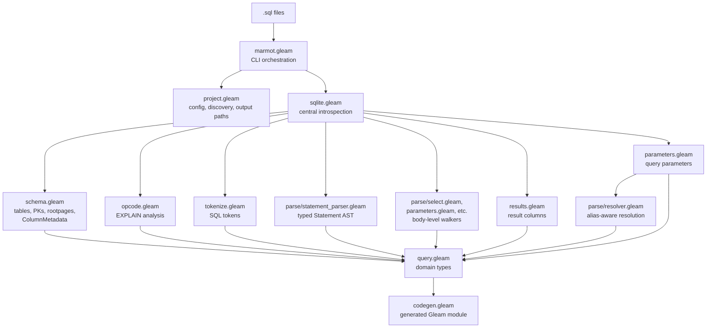
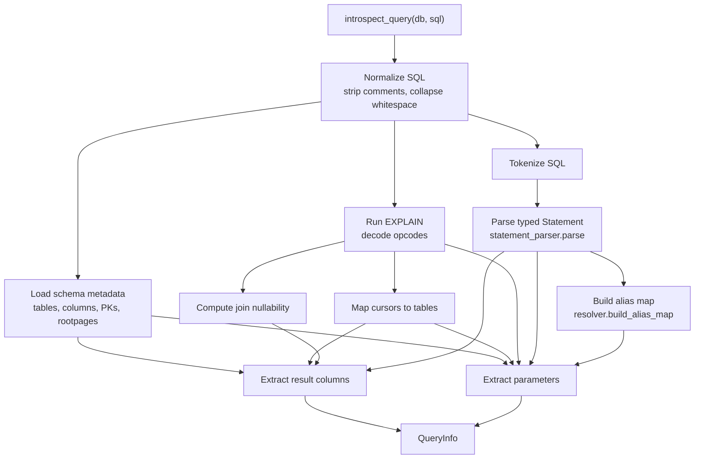

# Marmot internals

This guide covers the pipeline that turns `.sql` files into type-safe Gleam functions. Read it before changing the inference engine, codegen, or CLI orchestration.

## Architecture overview

## Data flow, step by step

### 1. Entry point (`marmot.gleam`)

`main()` parses argv and routes database commands before generation:
- `migrate` applies configured `NNN_description.sql` migration files and
  tracks applied versions in `schema_migrations`; with named database refs and
  no CLI selection, it runs each ref
- `seed` runs every configured seed file in filename order; with named database
  refs and no CLI selection, it runs each ref
- `reset` deletes the configured SQLite database file, removes SQLite sidecar
  files, then runs migrations and seeds

Without one of those commands, `run_generate()`:
- Reads `gleam.toml` for `[tools.marmot]` config
- Resolves one simple database target, one selected named ref, or every named
  ref when no name is selected
- Opens each SQLite database via `sqlight`
- Calls `generate_all()`, scoped to that target's SQL and output config

`generate_all()`:
1. Finds SQL directories (default: `src/**/sql/`; or `sql_dir` config)
2. Detects output path collisions (multiple sql/ dirs writing to the same file)
3. For each directory, calls `generate_for_directory()`

`generate_for_directory()`:
1. Lists `.sql` files in the directory
2. For each file, calls `process_sql_file()` to produce a `Query`
3. Passes all queries to `codegen.generate_module_with_config()`
4. Runs `gleam format` on the output, writes to disk

### 2. Config (`project.gleam`)

`Config` holds optional fields from `[tools.marmot]`:

| Field | Source | Purpose |
|---|---|---|
| `database` | CLI / env / toml | Path to SQLite file for introspection |
| `database_name` | CLI / toml | Selected named database reference |
| `output` | CLI / toml | Output directory for generated modules |
| `query_function` | toml only | Custom wrapper replacing `sqlight.query` |
| `sql_dir` | toml only | Override sql/ directory discovery |
| `migrations_dir` | named database / toml | Directory for migration files |
| `seeds_dir` | named database / toml | Directory for seed files |

Named database references live under `[tools.marmot.databases.NAME]` or
`[[tools.marmot.databases]] name = "NAME"`. They can provide `path`,
`migrations_dir`, `seeds_dir`, `sql_dir`, and `output`. `[tools.marmot].database`
remains supported as the simple single-database path. Mixing
`[tools.marmot].database` with named database refs is a config error.

`find_sql_directories()` has two modes:
- **Default mode** (`sql_dir: None`): recursively walks `src/` for directories named `sql`, skipping `src/generated`
- **Configured mode** (`sql_dir: Some("path")`): recursively finds all directories under `path` that contain `.sql` files

`output_path()` computes where a generated module lands. It finds the longest common prefix between the output directory and the sql directory, strips it, removes `sql` segments, and joins with output. Examples:
- `src/app/users/sql` + default output -> `src/generated/sql/app/users_sql.gleam`
- `src/server/accounts/sql` + output `src/server/generated/sql` -> `src/server/generated/sql/accounts_sql.gleam`

### 3. SQL processing (`process_sql_file` in `marmot.gleam`)

For each `.sql` file:
1. Reads the file, extracts the function name from the filename
2. Strips comments, validates SQL (non-empty, single query, no stray semicolons)
3. Parses the `-- returns: TypeName` annotation (optional shared row type)
4. Calls `sqlite.introspect_query()` for type information
5. Checks for duplicate column names and generated name collisions
6. Returns a `Query` with name, SQL, path, parameters, and columns

### 4. SQLite introspection (`sqlite.gleam`)

`introspect_query()` is the central pipeline. It takes a DB connection and normalized SQL, returns a `QueryInfo` with columns and parameters.

Pipeline stages:

1. **Normalize whitespace** (`parse.normalize_sql_whitespace`): strips comments via `query.strip_comments`, then normalizes whitespace in `parse/text.gleam` (newlines/tabs to spaces, collapse runs), preserving string literals.

2. **Load schema** (`schema.get_table_metadata_v2`): queries `sqlite_master` for table names and rootpages, `PRAGMA table_xinfo` for each table to get column names, types, nullability, and the `hidden` flag (so generated columns can be filtered later), and `PRAGMA table_list` for the WITHOUT-ROWID flag. Returns `TableMetadataV2` carrying `ColumnMetadata` (which adds `is_rowid_alias`, `is_generated`, and `hidden` to the public `Column`). Downstream consumers that only need the public shape derive a `Dict(String, List(Column))` view internally.

3. **EXPLAIN**: strips Marmot-specific `!`/`?` nullability suffixes from the SQL, wraps with `EXPLAIN`, and runs it against SQLite. The result is a list of `Opcode` values (addr, opcode name, p1-p5 operands).

4. **Cursor-to-table mapping**: scans opcodes for `OpenRead`/`OpenWrite`, which map SQLite's internal cursor numbers to table rootpages, then to table names via the rootpage mapping from step 2.

5. **Join nullability** (`opcode.compute_join_nullability`): identifies cursors that may produce NULL rows due to LEFT JOIN. When an outer join has no matching inner row, SQLite emits `NullRow` on the inner (right-side) table's cursor; `IfNullRow` tests this state. Columns resolved against nullable cursors are marked nullable in generated types. Also traces through `OpenAutoindex` cursors (transient indexes SQLite builds for unindexed JOINs).

6. **Tokenize** (`tokenize.tokenize`): grapheme-by-grapheme tokenizer that produces a `List(Token)`. Handles keywords, identifiers, string literals, quoted identifiers, numbers, parameters (`?`, `@name`), operators, and Marmot nullability overrides (`!` = non-null, `?` = nullable).

7. **Statement parsing** (`statement_parser.parse`): consumes the token stream and produces a typed `Statement` AST: `Select`, `Insert`, `Update`, `Delete`, or `Unsupported`. The AST carries parsed structure for boundaries that need it (FROM aliases as `TableBinding`, INSERT shape including conflict action and source variants, CTE headers) and clause token slices for bodies that don't (`select_list`, `where`, `set`, etc.). Boundary detection is grammar-aware: keywords like `WHERE` only fire as clause introducers at top-level paren depth 0, so subqueries no longer leak. CTE bodies stay as raw token slices.

8. **Result column extraction** (`results.extract_result_columns`): combines opcode tracing with structurally-derived select list and from-tables from the parsed `Statement`.
   - **Opcode-based**: traces `ResultRow` opcodes back through `Column`/`Rowid` to find source table columns. Authoritative when the column maps to a real table column.
   - **Body-level walker fallback**: `parse_select_item_list` operates on `body.select_list` (a slice from the parsed Statement) when opcode tracing can't resolve (sorter pseudo-cursors, complex expressions, aggregates). Uses column aliases where available.
   - For INSERT/UPDATE/DELETE with RETURNING, `extract_returning_columns` handles the RETURNING clause; the target table comes from `Statement.target.table.name.text`.

9. **Parameter extraction** (`parameters.extract_parameters`): dispatches on the parsed `Statement` variant.
   - **SELECT/DELETE and UPDATE WHERE**: builds an alias map from the FROM clause via `resolver.build_alias_map`, then resolves each binder via `resolver.resolve_qualified` / `resolver.resolve_bare`. Resolution returns one of six outcomes; only `UnknownTableRef` (for CTE-named or otherwise unintrospected tables) falls back to `StringType`. The other four error outcomes (`AmbiguousColumn`, `UnknownQualifiedAlias`, `UnknownColumnInKnownTable`, `UnknownBareColumn`) propagate as `ParameterResolutionError` and become typed `MarmotError` variants at the `sqlite.gleam` boundary with the SQL file path attached. Read-position parameters are always non-nullable, regardless of the referenced column's nullability. This intentionally mirrors Squirrel's read-parameter surface.
   - **UPDATE SET**: parses the SET body separately and treats parameters as writes. The parameter type and nullability come from the target column, so assigning into a nullable column produces `Option(T)`.
   - **INSERT VALUES**: when the column list is omitted, derives bindable columns from `ColumnMetadata` in declared order, filtering generated columns (`hidden != 0`). Multi-row VALUES walks every row and emits a parameter per placeholder expression. `write_nullable = column.nullable || is_rowid_alias` so rowid-alias columns are nullable on write (SQLite auto-assigns) even when the read-side is NOT NULL.
   - **Pre-flight validation** in `sqlite.gleam` catches row-count mismatches before EXPLAIN, surfacing `InsertValuesCountMismatch` (a typed error with row index, expected, and got counts) instead of SQLite's generic message. Skipped when the target table is unknown (lets EXPLAIN report "no such table").
   - Named parameters (`@name`) are discovered by `binder.find_param_binders`. Repeated parameters are deduplicated by `deduplicate_parameter_names`.

### 5. Domain model (`query.gleam`)

Defines the types that flow through the pipeline:

- **`ColumnType`**: `IntType | FloatType | StringType | BitArrayType | BoolType | TimestampType | DateType`
- **`Column`**: `name: String`, `column_type: ColumnType`, `nullable: Bool`
- **`Parameter`**: same shape as Column, representing a `?` or `@name` parameter
- **`Query`**: `name`, `sql`, `path`, `parameters`, `columns`, `custom_type_name`

Also provides helpers: `parse_sqlite_type` (SQLite type string to ColumnType), `sanitize_identifier` (kebab/snake case to Gleam), `strip_comments` (comment removal preserving string literals), `function_name` (filename to function name), `gleam_type` (ColumnType to Gleam type string).

The comment/whitespace helpers (`strip_comments`, `normalize_whitespace`) live in `query.gleam` because they're needed before any SQL analysis (validation, annotation parsing). The lower-level SQL text operations in `sqlite/parse/text.gleam` are for post-normalization use (whitespace normalization of already-stripped SQL, suffix stripping).

### 6. Code generation (`codegen.gleam`)

`generate_module_with_config()` assembles a complete Gleam module from a list of `Query` values. Build phases:

1. **Import selection**: scans all queries and parameters to determine which imports are needed (`sqlight`, `decode`, `option`, `timestamp`, `calendar`). Also adds the custom query function's import if configured.

2. **Helper emission**: conditionally adds private helper functions:
   - `timestamp_to_int()` when any parameter is `TimestampType`
   - `date_decoder()` when any column is `DateType`
   - `date_to_string()` when any parameter is `DateType`

3. **Shared row groups**: queries annotated with `-- returns: TypeName` in the same directory are grouped. All queries in a group must return identical column shapes (same names, types, nullability, order). Generates one shared row type + decoder per group.

4. **Row type generation**: for unannotated queries, generates a `TypeNameRow` custom type with labelled fields. Field names are sanitized SQL column names (snake_case -> snake_case, kebab-case -> snake_case).

5. **Function generation**:
   - **SELECT/returning queries**: generates `pub fn name(db db: Connection, param type: ..., ...) -> Result(List(RowType), sqlight.Error)` with inline decoder
   - **INSERT/UPDATE/DELETE without RETURNING**: generates `pub fn name(db db: Connection, ...) -> Result(List(Nil), sqlight.Error)` with `decode.success(Nil)`
   - **Shared-type queries**: calls the shared decoder instead of inlining

6. **Encoder/decoder mapping**: each `ColumnType` maps to a specific encoder (`sqlight.int`, `sqlight.text`, etc.) and decoder (`decode.int`, `decode.string`, etc.). Nullable columns wrap in `decode.optional`. `Timestamp` columns decode from Unix seconds; `Date` columns decode from ISO strings.

The module also handles name collision detection: generated function names and row type names are checked for duplicates within a module.

## Error handling (`error.gleam`)

`MarmotError` is a union of all error variants. `to_string()` produces pretty-printed error messages with box-drawing characters and hints. Errors flow as `Result` types through the pipeline; the CLI layer converts them to stderr output and non-zero exit codes.

## Architecture decisions

- **EXPLAIN-based inference**: types come from live SQLite introspection via `EXPLAIN`, `PRAGMA table_xinfo`, and `PRAGMA table_list`. The database must exist with the current schema at generation time.
- **Single-pass schema loading**: `get_table_metadata_v2()` loads all table schemas, PKs, rootpages, and rowid-alias/generated-column flags in one pass to avoid repeated `PRAGMA` calls.
- **Grammar-aware statement parsing**: `statement_parser.parse` produces a typed `Statement` AST that drives consumer dispatch. The parser recognizes CTE prefixes and correctly classifies the statement kind after them, unlike the earlier first-token heuristic.
- **Alias-aware column resolution**: `resolver` builds an alias map from the parsed FROM clause and surfaces typed errors for ambiguous or unknown references. Only the CTE/view fallback (`UnknownTableRef`) silently degrades to `StringType`; the other four resolution failures become user-facing `MarmotError` variants.
- **Read vs write nullability for rowid aliases**: `INTEGER PRIMARY KEY` on a normal rowid table is non-null on read (SQLite always assigns a rowid) but nullable on write (binding NULL means "auto-assign"). `ColumnMetadata.is_rowid_alias` is the schema-level source of truth, computed once in the loader. Parameter inference for column-less `INSERT VALUES` uses `write_nullable = column.nullable || is_rowid_alias`. Don't reintroduce inline `pk > 0 && IntType -> nullable: False` shortcuts; they're wrong for `WITHOUT ROWID` and don't carry the read/write distinction.
- **Tokenize once, analyze many**: the tokenizer runs once per query; its output feeds statement parsing, result extraction, and parameter extraction.
- **Suffix-based nullability overrides**: `col_name!` in SQL aliases forces non-null, `col_name?` forces nullable. These are Marmot extensions stripped before EXPLAIN but preserved in tokenized form for type inference.
- **Zero external tool dependencies**: everything runs through `sqlight` (Erlang NIF).
